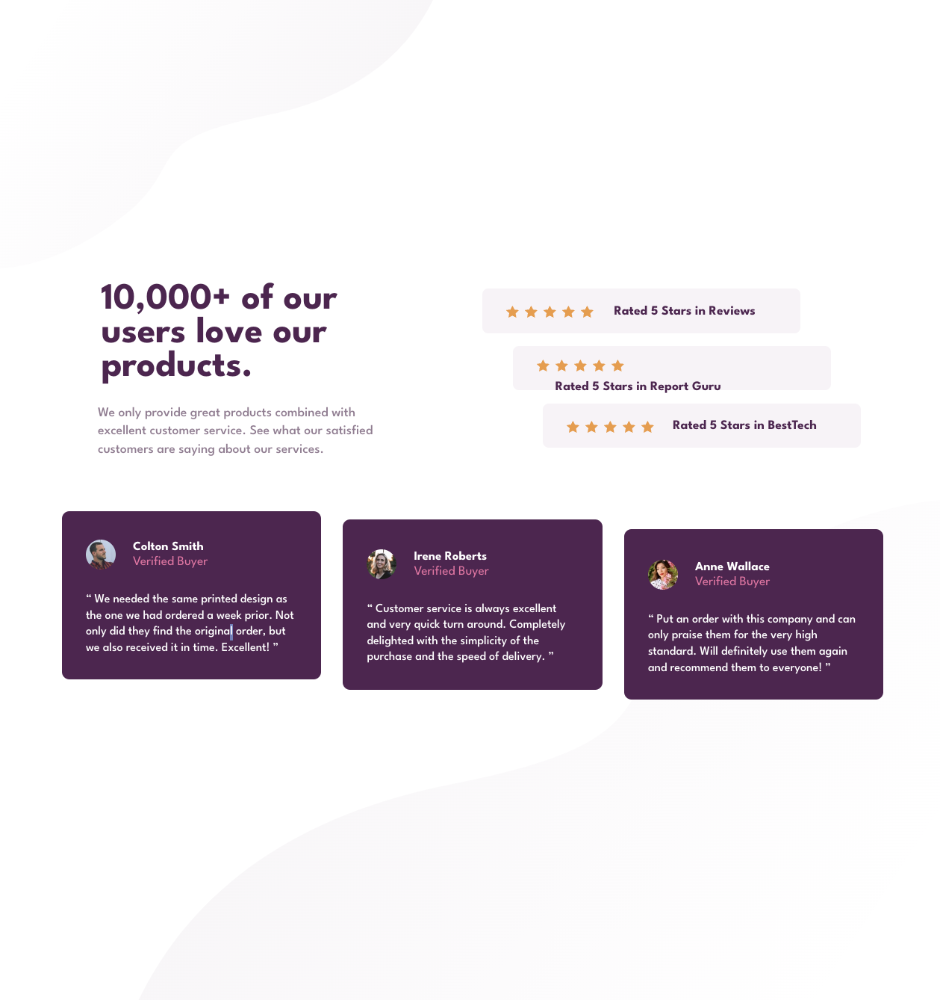

# Frontend Mentor - Social proof section solution

This is a solution to the [Social proof section challenge on Frontend Mentor](https://www.frontendmentor.io/challenges/social-proof-section-6e0qTv_bA). Frontend Mentor challenges help you improve your coding skills by building realistic projects.

## Table of contents

- [Overview](#overview)
  - [The challenge](#the-challenge)
  - [Screenshot](#screenshot)
  - [Links](#links)
- [My process](#my-process)
  - [Built with](#built-with)
  - [Useful resources](#useful-resources)
- [Author](#author)

## Overview

### The challenge

Users should be able to:

- View the optimal layout for the section depending on their device's screen size

### Screenshot

### Links

- Solution URL: [Github repo](https://github.com/mrcordova/social-proof-section)
- Live Site URL: [Github page](https://mrcordova.github.io/social-proof-section/)

## My process

### Built with

- Semantic HTML5 markup
- CSS custom properties
- Flexbox
- CSS Grid
- Mobile-first workflow

### Useful resources

- [Background Image repeat](https://stackoverflow.com/questions/8679066/make-image-not-background-img-in-div-repeat) -
  How to use empty div to show images indirectly.
- [Add space to background image](https://stackoverflow.com/questions/15199863/can-you-create-space-between-background-image-repeats) - I learned the features that background image can use.

## Author

- Website - [mrcordova](https://www.your-site.com)
- Frontend Mentor - [@mrcordova](https://www.frontendmentor.io/profile/mrcordova)
